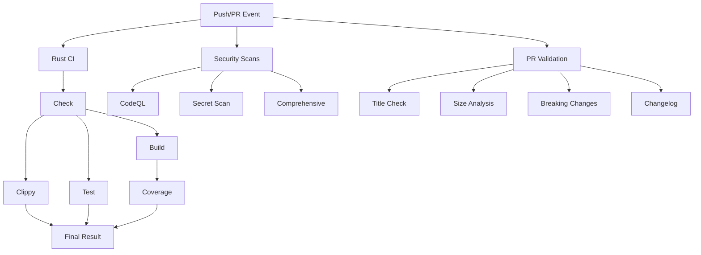
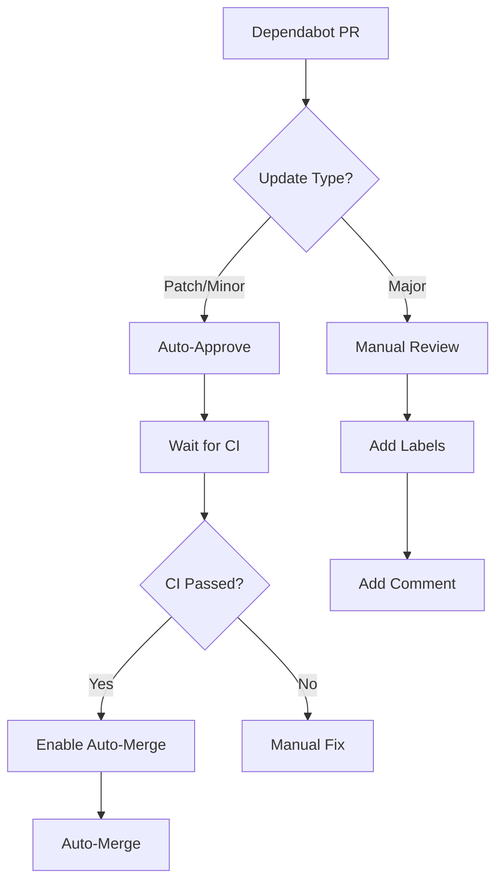

# GitHub Actions Architecture

This document describes the architecture and relationships between all GitHub Actions workflows.

## Workflow Architecture Diagram

```
┌─────────────────────────────────────────────────────────────────────────────┐
│                           PUSH TO MAIN/DEVELOP                              │
└────────────────┬────────────────────────────────────────────────────────────┘
                 │
                 ├─────────────────────────────────────────────────────────────┐
                 │                                                             │
    ┌────────────▼───────────┐                              ┌─────────────────▼─────────────┐
    │    Rust CI Pipeline    │                              │   Security Workflows          │
    │   (rust-ci.yml)        │                              │                               │
    ├────────────────────────┤                              ├───────────────────────────────┤
    │  ┌──────────────────┐  │                              │ • CodeQL Analysis             │
    │  │ Check (S/B/N)    │  │                              │ • Secret Scanning             │
    │  └────────┬─────────┘  │                              │ • Comprehensive Security      │
    │           │             │                              │   - Trivy (vuln + config)     │
    │  ┌────────▼─────────┐  │                              │   - Cargo Audit              │
    │  │ Build (S/B)      │  │                              │   - Cargo Geiger             │
    │  │ Clippy           │  │                              │   - OSV Scanner              │
    │  │ Test (S/B)       │  │                              │   - Semgrep                  │
    │  └────────┬─────────┘  │                              │   - Snyk (optional)          │
    │           │             │                              └───────────────────────────────┘
    │  ┌────────▼─────────┐  │
    │  │ Coverage         │  │
    │  │ Format Check     │  │
    │  │ Audit            │  │
    │  │ Deny             │  │
    │  │ Documentation    │  │
    │  └──────────────────┘  │
    └────────────────────────┘

┌─────────────────────────────────────────────────────────────────────────────┐
│                              PULL REQUEST                                    │
└────────────────┬────────────────────────────────────────────────────────────┘
                 │
                 ├────────────────────────────┬─────────────────────────────────┐
                 │                            │                                 │
    ┌────────────▼───────────┐   ┌───────────▼────────────┐   ┌───────────────▼────────┐
    │  Rust CI Pipeline      │   │  PR Validation         │   │  Dependency Review      │
    │  (rust-ci.yml)         │   │  (pr-validation.yml)   │   │  (in security-comp.)    │
    ├────────────────────────┤   ├────────────────────────┤   ├─────────────────────────┤
    │  All checks run        │   │ • Semantic PR title    │   │ • Review dependencies   │
    │  Security scans run    │   │ • Size analysis        │   │ • License validation    │
    │                        │   │ • Breaking changes     │   │ • Security checks       │
    │                        │   │ • Changelog check      │   └─────────────────────────┘
    └────────────────────────┘   └────────────────────────┘

┌─────────────────────────────────────────────────────────────────────────────┐
│                         DEPENDABOT PULL REQUEST                              │
└────────────────┬────────────────────────────────────────────────────────────┘
                 │
    ┌────────────▼─────────────────────────────────────────┐
    │  Dependabot Auto-Merge (dependabot.yml)             │
    ├──────────────────────────────────────────────────────┤
    │  1. Fetch metadata (update type)                     │
    │  2. If patch/minor:                                  │
    │     ├─ Auto-approve                                  │
    │     ├─ Wait for CI checks                            │
    │     └─ Enable auto-merge (squash)                    │
    │  3. If major:                                        │
    │     ├─ Label for manual review                       │
    │     └─ Add comment                                   │
    └──────────────────────────────────────────────────────┘

┌─────────────────────────────────────────────────────────────────────────────┐
│                         SCHEDULED WORKFLOWS                                  │
└────────────────┬────────────────────────────────────────────────────────────┘
                 │
                 ├───────────────────┬──────────────────┬────────────────────┐
                 │                   │                  │                    │
    ┌────────────▼──────────┐ ┌─────▼──────────┐ ┌────▼───────────┐ ┌──────▼────────┐
    │  Auto-Fix             │ │  Secret Scan   │ │  CodeQL        │ │  Security     │
    │  Monday 00:00         │ │  Daily 03:00   │ │  Monday 02:00  │ │  Sunday 00:00 │
    ├───────────────────────┤ ├────────────────┤ ├────────────────┤ ├───────────────┤
    │ cargo fix             │ │ Gitleaks       │ │ Full analysis  │ │ Full suite    │
    │ cargo fmt             │ │ TruffleHog     │ │ SARIF upload   │ │ All tools     │
    │ Create PR if changes  │ │ Trivy Secrets  │ └────────────────┘ └───────────────┘
    └───────────────────────┘ └────────────────┘

┌─────────────────────────────────────────────────────────────────────────────┐
│                         MANUAL WORKFLOWS                                     │
└────────────────┬────────────────────────────────────────────────────────────┘
                 │
                 │  All workflows support manual trigger (workflow_dispatch)
                 │
                 └─ Use GitHub Actions UI to manually run any workflow
```

## Workflow Relationships

### Primary Workflows



### Dependabot Flow



## Job Dependencies

### Rust CI Pipeline

```
Check (S/B/N)
    ├─→ Build (S/B)
    ├─→ Clippy
    ├─→ Test (S/B)
    │
Test (S/B) ─→ Coverage
    │
All Jobs ─→ Result
```

**Legend:**
- S = Stable
- B = Beta  
- N = Nightly

### Security Pipeline

```
Parallel Execution:
├─ Trivy Vuln Scan ─→ SARIF Upload
├─ Trivy Config Scan ─→ SARIF Upload
├─ Cargo Audit
├─ Cargo Geiger ─→ Artifact Upload
├─ Dependency Review (PR only)
├─ OSV Scanner
├─ Semgrep ─→ SARIF Upload
└─ Snyk ─→ SARIF Upload
    │
    All ─→ Summary
```

## Data Flow

### Artifacts Generated

```
┌──────────────────┐
│  Rust CI         │
│  ─────────       │
│  • lcov.info     │──→ Codecov
│  • test results  │──→ GitHub
└──────────────────┘

┌──────────────────┐
│  Security        │
│  ─────────       │
│  • SARIF files   │──→ GitHub Security Tab
│  • JSON reports  │──→ Artifacts
│  • MD reports    │──→ Artifacts
└──────────────────┘

┌──────────────────┐
│  Auto-Fix        │
│  ─────────       │
│  • Code changes  │──→ New PR
└──────────────────┘
```

### Cache Flow

```
┌─────────────────┐
│  First Run      │
│  ─────────      │
│  1. Download    │
│  2. Build       │
│  3. Cache       │
└────────┬────────┘
         │
         ▼
┌─────────────────┐
│  Subsequent     │
│  ─────────      │
│  1. Load cache  │ (5-10x faster)
│  2. Build       │
└─────────────────┘
```

## Execution Matrix

### Rust Version Matrix

| Job      | Stable | Beta | Nightly |
|----------|--------|------|---------|
| Check    | ✅     | ✅   | ✅*     |
| Build    | ✅     | ✅   | ❌      |
| Test     | ✅     | ✅   | ❌      |
| Clippy   | ✅     | ❌   | ❌      |
| Coverage | ✅     | ❌   | ❌      |
| Format   | ✅     | ❌   | ❌      |

*Nightly failures allowed

### Trigger Matrix

| Workflow              | Push | PR | Schedule | Manual |
|-----------------------|------|----|---------:|--------|
| Rust CI               | ✅   | ✅ | ❌       | ✅     |
| CodeQL                | ✅   | ✅ | Weekly   | ✅     |
| Secret Scanning       | ✅   | ✅ | Daily    | ✅     |
| Security Comprehensive| ✅   | ✅ | Weekly   | ✅     |
| Auto-Fix              | ❌   | ❌ | Weekly   | ✅     |
| PR Validation         | ❌   | ✅ | ❌       | ❌     |
| Dependabot Auto-Merge | ❌   | ✅ | ❌       | ❌     |
| Deploy Staging        | ✅*  | ❌ | ❌       | ✅     |

*Only on `develop` branch

## Performance Optimization

### Caching Strategy

```
Layer 1: Cargo Registry Cache
   └─ ~/.cargo/registry/
   └─ ~/.cargo/git/

Layer 2: Build Cache  
   └─ target/

Layer 3: Dependency Cache
   └─ Cargo.lock dependencies
```

**Cache Keys:**
- Base: `rust-{os}-{rust-version}-{Cargo.lock-hash}`
- Job-specific: `rust-{os}-{rust-version}-{job}`

### Parallel Execution

```
Rust CI Jobs:
├─ Check (S/B/N) ────┐ (parallel)
├─ Build (S/B) ──────┤
├─ Clippy ───────────┤
└─ Test (S/B) ───────┘
    │
    └─ Coverage (sequential, depends on Test)

Security Jobs:
├─ Trivy Vuln ───┐
├─ Trivy Config ─┤
├─ Cargo Audit ──┤ (all parallel)
├─ Geiger ───────┤
├─ OSV ──────────┤
├─ Semgrep ──────┤
└─ Snyk ─────────┘
```

## Security Integration

### SARIF Upload Points

All security findings centralized in GitHub Security tab:

```
CodeQL ──────────┐
Secret Scan ─────┤
Trivy Vuln ──────┤──→ GitHub Security Tab
Trivy Config ────┤
Semgrep ─────────┤
Snyk ────────────┘
```

### Security Layers

```
Layer 1: Code Analysis
   └─ CodeQL (static analysis)

Layer 2: Secret Detection  
   ├─ Gitleaks
   ├─ TruffleHog
   └─ Trivy Secrets

Layer 3: Dependency Scanning
   ├─ Cargo Audit
   ├─ OSV Scanner
   ├─ Trivy Vulnerabilities
   └─ Snyk

Layer 4: Configuration
   ├─ Trivy Config
   └─ Semgrep

Layer 5: Code Quality
   └─ Cargo Geiger (unsafe code)
```

## Monitoring Points

### Success Metrics

```
┌─────────────────────────────────────┐
│  Key Performance Indicators         │
├─────────────────────────────────────┤
│ • Build time: <10 min (with cache)  │
│ • Test coverage: >80%               │
│ • Security findings: 0 high/critical│
│ • Dependabot PRs: <20 open          │
│ • Auto-merge rate: >90% (patch)     │
│ • CI pass rate: >95%                │
└─────────────────────────────────────┘
```

### Health Checks

```
Daily:
├─ Secret scanning results
└─ Open PR count

Weekly:
├─ Security scan summary
├─ Dependabot status
└─ CI performance metrics

Monthly:
├─ Coverage trends
├─ Workflow execution time
└─ Cost analysis
```

## Scalability

### Current Capacity

```
Concurrent Jobs:
├─ Check: 3 (S/B/N)
├─ Build: 2 (S/B)
├─ Test: 2 (S/B)
└─ Security: 7+ (parallel)

Total: ~14 concurrent jobs per run
```

### Future Expansion

```
Platform Matrix:
├─ ubuntu-latest (current)
├─ macos-latest (planned)
└─ windows-latest (planned)

Feature Matrix:
├─ all-features (current)
├─ no-default-features (planned)
└─ specific-features (planned)
```

## Disaster Recovery

### Workflow Backup

```
Critical Files:
├─ .github/workflows/*.yml
├─ .github/dependabot.yml
└─ deny.toml, Cargo.toml

Backup Strategy:
└─ Git version control + GitHub backup
```

### Rollback Procedure

```
1. Identify problematic workflow
2. Revert to previous version:
   git revert <commit>
3. Push to main
4. Monitor Actions tab
```

## References

- [GitHub Actions Docs](https://docs.github.com/en/actions)
- [Rust CI Guide](https://doc.rust-lang.org/cargo/guide/continuous-integration.html)
- [Security Best Practices](https://docs.github.com/en/code-security)

---

*This architecture documentation is maintained alongside the workflows.*
*Last Updated: 2025-11-13*
