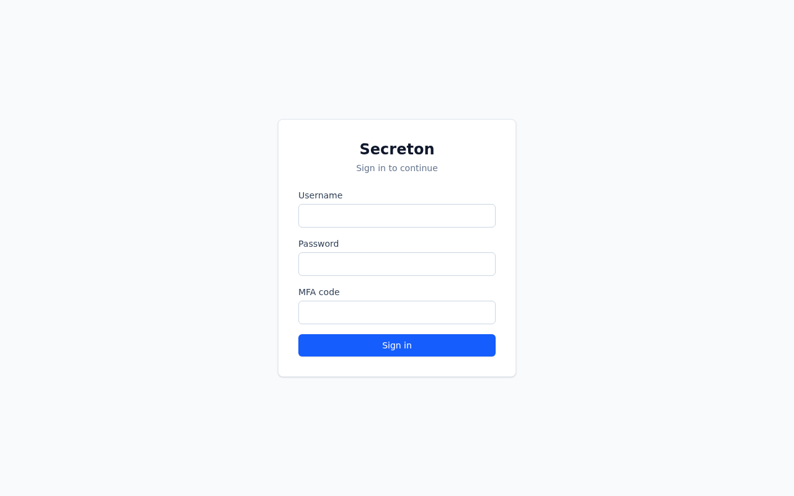
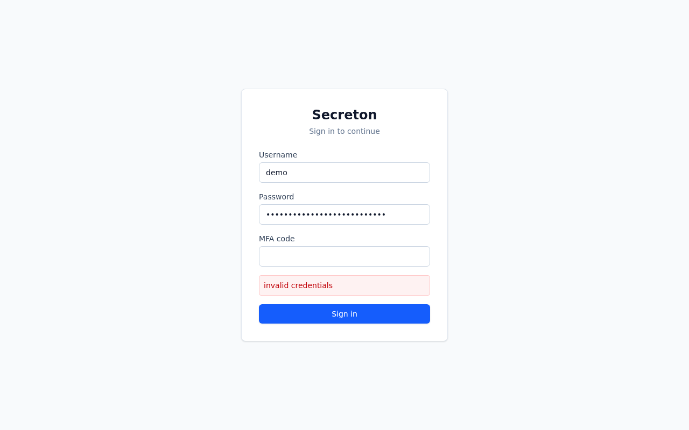
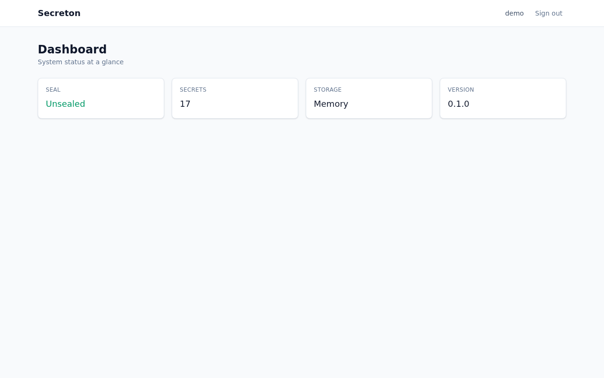
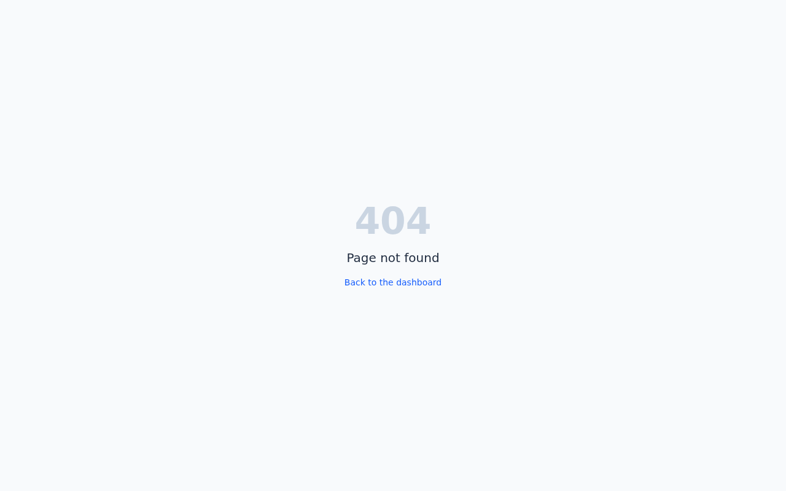
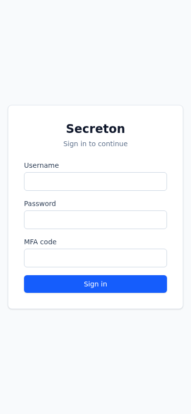
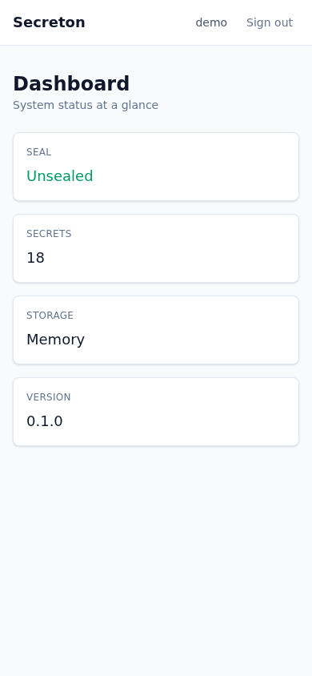

# Secreton

> **Alpha.** Under active development and not production-ready. APIs and storage
> schemas may change without a migration path.

A secrets-management platform in Rust: a [Leptos](https://leptos.dev) web application and a
REST + gRPC API, served by **one Axum process on one port**.

## Screenshots

Every view below was captured from a running build and checked for the failure modes that
make a screenshot useless — a blank body, a raw error, a layout that overflows the
viewport, or a console full of errors. The capture script is
[`scripts/screenshots.mjs`](scripts/screenshots.mjs); it fails the run if any view regresses.

### Sign in

The form is server-rendered and posts without JavaScript. The third field is the MFA code
and is optional unless the account has MFA enabled.

<p align="center">
  
</p>

### Sign in, rejected

A wrong password produces a plain message and leaves the form usable. The error is
deliberately identical for "no such user" and "wrong password" — distinguishing them turns
the form into a username oracle.

<p align="center">
  
</p>

### Dashboard

Shown after sign-in. Status is fetched with a `Resource` during server rendering, so the
values arrive in the server's own response rather than from a follow-up client request. The
response streams: the fallback is flushed first and the resolved cards follow, which is why
the capture script waits for the page to settle before taking the shot.

<p align="center">
  
</p>

### Not found

An unrouted path answers HTTP 404 with the same chrome, not a 200 carrying the words
"not found".

<p align="center">
  
</p>

### Mobile

The same two views at 390 × 844, with no horizontal overflow.

<p align="center">
  
  
</p>

## What it is

Storage, encryption and access control for sensitive values, with a versioned KV engine,
encryption-as-a-service, a certificate authority, SSH certificate signing, dynamic database
credentials and TOTP.

The architecture is the point: it is meant to be a foundation you build on, so the
boundaries are enforced rather than described. `crates/domain` has no I/O and compiles for
WebAssembly, which is why the UI shares its types. `crates/engines` has no HTTP, which is
why the same service backs a REST handler, a gRPC method and a Leptos server function
without a translation layer.

## Quick start

Requires the toolchain pinned in `rust-toolchain.toml` (Rust 1.94.1, installed
automatically by rustup) and [`cargo-leptos`](https://github.com/leptos-rs/cargo-leptos).

```bash
# 0.3.7 is the last release whose lockfile resolves `wasm_split_cli_support` 0.2.2.
# Later releases need 0.2.3, which uses `if let` guards — unstable on 1.94.1 — so an
# unpinned install aborts with E0658. See the Dockerfile for the full note.
cargo install cargo-leptos --locked --version 0.3.7

# Required: the server refuses to start without it.
export SECRETON__AUTH__JWT__SECRET="$(openssl rand -base64 48)"

cargo leptos serve
```

Then open <http://localhost:3000>. No database is needed — storage defaults to in-memory,
so a fresh checkout runs with no setup. State is lost on restart; configure PostgreSQL in
`secreton.toml` for anything else.

The first start is sealed and has no accounts. Initialise it by generating unseal shares
and unsealing with a quorum of them:

```bash
# Generate shares (here 3 shares, 2 required to unseal) and unseal. The response that
# reaches the threshold carries a one-time root token; store it, it is not shown again.
KEYS=$(curl -sX POST localhost:3000/api/v1/sys/init -H 'Content-Type: application/json' \
  -d '{"shares":3,"threshold":2,"root_username":"root"}' | jq -r '.data.keys[]')

ROOT=""
while read -r k; do
  ROOT=$(curl -sX POST localhost:3000/api/v1/sys/unseal -H 'Content-Type: application/json' \
    -d "{\"key\":\"$k\"}" | jq -r '.data.root_token // empty')
  [ -n "$ROOT" ] && break
done <<< "$KEYS"
```

Store the shares and the root token somewhere safe — the shares are the only way to unseal
after a restart.

Root has no password login, so the UI needs a real account. Create one with the root token:

```bash
curl -sX POST localhost:3000/api/v1/auth/users \
  -H "Authorization: Bearer $ROOT" -H 'Content-Type: application/json' \
  -d '{"username":"demo","password":"change-me-please","email":"demo@example.com",
       "roles":["user"],"permissions":[]}'
```

Then sign in at <http://localhost:3000/login> with that username and password.

With Docker:

```bash
cp .env.example .env   # fill in SECRETON_JWT_SECRET and POSTGRES_PASSWORD
docker compose up --build
```

`compose.yaml` runs the server and a PostgreSQL 17 instance; only the app's port 3000 is
published, and the database is reachable solely from the compose network.

## Layout

Ten crates, strictly layered — a crate may only depend on those above it.

| Crate | Lines | What it holds |
|---|---:|---|
| `crates/domain` | 1.7k | Shared types, the one `SecretonError`, the API envelope. No I/O, no web framework, compiles for wasm32. |
| `crates/crypto` | 7.9k | AEAD, KDFs, signing, Shamir sharing, the transit engine, the storage barrier. |
| `crates/storage` | 4.4k | One `StorageBackend` trait; memory, file, PostgreSQL, Redis, Raft. |
| `crates/auth` | 11.3k | Authentication methods, identity, MFA, tokens, the policy engine, governance. |
| `crates/engines` | 21.1k | Secret engines, seal, audit, lifecycle, and the `Services` graph. No HTTP. |
| `crates/ui` | 0.8k | The Leptos application. Compiles twice: into the server, and to wasm. |
| `crates/server` | 8.8k | Axum router, handlers, middleware, gRPC, and the binary. |
| `crates/client` · `cli` · `agent` | 0.4k · 1.0k · 1.9k | Typed HTTP client and the two auxiliary binaries. |

About 59k lines of Rust in total.

## What is supported

Claims here match what is implemented and tested; anything not listed is not present.

**Secret engines** — KV v2 (versioned, with rollback), Transit (encryption as a service),
PKI, SSH certificate signing, TOTP, and dynamic database credentials for PostgreSQL and
MySQL. The database engine issues a real account on the target server and drops it on
revocation — both paths are covered by integration tests that connect and check the
account exists, authenticates, carries the role's grants, and is gone after revoking. The
`postgres` and `mysql` cargo features select which drivers are compiled in, and a database
whose driver is absent is refused rather than served. MySQL roles take an optional
`mysql_host` (default `%`) so an account can be restricted to the address that will use
it.

**Storage** — in-memory and file (always available, no external service), PostgreSQL
(recommended), Redis, and Raft. Raft is single-node and **experimental**: no cluster
membership changes, no leader election across processes.

**Authentication** — username/password, AppRole for machine-to-machine, and OIDC for human
SSO. Sessions in the browser are `HttpOnly` cookies; programmatic clients use
`Authorization: Bearer`.

**Cryptography** — AES-256-GCM and ChaCha20-Poly1305 for data, Argon2id for passwords,
Ed25519 and P-256/P-384 for signatures, Shamir sharing for the unseal flow. No RSA key is
ever constructed or accepted; see [SECURITY.md](SECURITY.md) for why the `rsa` crate is
still in the tree transitively and why its code is unreachable.

**Interfaces** — REST under `/api/v1`, OpenAPI at `/api-docs/openapi.json`, liveness and
readiness at `/health` and `/health/ready`, gRPC (with health checking and reflection) on
the same port, and Leptos server functions for the UI.

## Development

```bash
cargo fmt --all
cargo clippy --workspace --locked --all-targets -- -D warnings
cargo test   --workspace --locked

# The UI must keep compiling for wasm; this is the check that catches a
# server-only dependency leaking into crates/ui.
cargo check -p secreton-ui --locked --target wasm32-unknown-unknown \
    --no-default-features --features hydrate
```

`cargo leptos serve` runs the server, the WASM build and Tailwind in one process. The
process serves the UI, the REST API and gRPC from a single listener on port 3000; there is
no second HTTP stack and no port offset.

### Screenshots

`cargo leptos serve` in one terminal, then:

```bash
node scripts/screenshots.mjs
```

It signs in through the real form — the session lives in an `HttpOnly` cookie, so driving
the form is the only way in — captures every view into `docs/screenshots/`, and exits
non-zero if any view is blank, errored, overflowing, or logs an unexpected console error.

[`AGENTS.md`](AGENTS.md) is the working reference: layout, commands, the invariants that
review enforces, and how to add an endpoint, a page or a storage backend. It applies to
human contributors as much as to AI agents.

Architecture decisions and the evidence behind them are in [`docs/adr/`](docs/adr/); the
Indonesian-language system model is under [`docs/architecture/`](docs/architecture/).

## Security

Report vulnerabilities privately — see [SECURITY.md](SECURITY.md). Do not open a public
issue.

## License

Apache-2.0. See [LICENSE](LICENSE).
